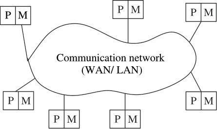

**Type-Extensible Object Notation: JSON with Syntax for Types**
---

_Master's Thesis in Information Technology_

 

Thor Wessel Lindberg
 
Department of Digital Design
 
IT-University of Copenhagen, Denmark
 
[mawl@itu.dk](mailto:mawl@itu.dk)

Dr. Jørgen Staunstrup
 
Department of Computer Science
 
IT-University of Copenhagen, Denmark
 
[jst@itu.dk](mailto:jst@itu.dk)

 

<b><i>Abstract—</i></b>Object-oriented programming allows developers to logically segment code, but as data is transmitted between languages and distributed across heterogeneous systems, these objects need to be serialised and deserialised. Heterogeneity creates a multitude of potential validation conflicts, as data formats must balance human readability with safety. This report builds on existing research into data formats for object serialisation, by suggesting an extensible syntax on top of the JavaScript Object Notation (JSON), with an additional backwards-compatibility layer.

 

Table of Contents
---

[Introduction](#introduction)

[Implementation](#implementation)

[Vocabulary](#vocabulary)

[Related Work](#related-work)

[Experiment Setup](#experiment-setup)

[Results](#results)

[Discussion](#discussion)

[Conclusion](#conclusion)

[Future Work](#future-work)

 

Introduction
---

As the prevalence of smartphones and internet of things (IoT) devices increasingly dictate the human experience, the software industry has pivoted towards connectivity-centered development. The common mobile software application is fully reliant on an internet connection, acting almost exclusively as a recipient (client) for transmitted data. These clients typically serve purposes such as social media communication, content consumption, user account access etc.

This reliance on connectivity means the software becomes a front-end client in a distributed computing system, with the logistical and computational responsibilities assigned and distributed to and among a network of devices. With this reality comes a series of architectural considerations and decisions that inform how and to what extent the front-end software is designed, developed and maintained.

A main feature of distributed systems is their ability to handle hardware and software heterogeneity, as information must travel digitally and physically across layers of applications, networks, and hardware. Heterogeneity manifests as differences in protocols, programming language features, and data formats. Heterogeneous systems must have the ability to transmit and parse information across layers, despite these differences. As data transmission has become ubiquitous, it is a great starting point for designing new software. The [vocabulary section](#vocabulary) explores the landscape of distribution and data transmission in-depth, establishing a vocabulary of terminology used for analysing and discussing the results of this project's experiment.

Existing research predominantly evaluates data serialisation formats from a feature, performance, and efficiency perspective. While these aspects are quantifiable, measurable, and potentially motivate decisions for designing large-scale data transmission systems, they fail to illustrate the conditions that inform the choice of data format for the common software development team. As performance differences are negligible, these conditions are likely more abstract and extend beyond development into the organisational structures and division of responsibilities in the team and between levels of developers.

The contribution of this paper is an exploration into the balance between readability and safety in the JavaScript Object Notation (JSON), in order to propose a derived extensible format informed by the value perspective of developers. This proposed format, conceptualised as the Type-Extensible Object Notation (TXON), is paired with a translation layer written in JavaScript, to provide full compatibility with JSON data and language parsers. TXON aims to offer both a human-readable yet safe and extensible format, as well as extensible types in the data.

There exists a rich history of design philosophy in programming language and data format syntax, features, and architecture. It is crucial to preface the project with this historical perspective, as the project has to build upon firmly established structures and rigid practices. This contextualisation ensures that decisions made for the project are grounded in the realities of software development, and thus takes into consideration any barriers to implementation of the proposal.

Design philosophy extends to software development, as human-readable code becomes a tool for collaboration and communication rather than a set of machine instructions. The human perspective is at the core of programming languages, as their aim is to be accessible and perceivable to humans. Programming code is eventually translated to assembly and then machine code, before it is executed by the processing unit. The implications are that programming language design should facilitate and motivate efficiency from a human perspective, in the interplay between man and machine.

[Martin, R.C. (2018)](#martin2018clean) provides instructions on _architecting clean software_. His approach is grounded in a shared historical perspective of software segmentation. He defines _clean code_ as concise communication of purpose and flexibility to modifications [(Martin, R.C., 2018, p. 310)](#martin2018clean). He defines _clean architecture_ as division into autonomous layers and independence within the system. The layers should include at least one for business rules and another for user/system interfaces. The system should be independent and testable without frameworks, user interfaces, database choice, and external agencies [(Martin, R.C., 2018, p. 196)](#martin2018clean).

 

Figure 1: The clean architecture.

 

As seen in figure [Figure 1](#cleanarchitecture), this division results in four types of layers, guided by the various types of business rules and internal or external dependencies. This fragmentation of components facilitates the independent development, testing and evolution of the software layers. This philosophical perspective on software illustrates the importance of design in software, as system architecture can either motivate or inhibit developers from achieving their desired design goals.

XML (eXtensible Markup Language) is...

JavaScript Object Notation (JSON) is...

[Charmaz, Kathy (2006)](#charmaz2006constructing) defines a qualitative research perspective referred to as _Grounded Theory_. While this is a set of methodologies, it is also a general approach to conducting research and analysing the qualitative results of interviewing. From her perspective, qualitative data is gathered and processed for the purpose of guiding and grounding research decisions, rather than to qualitatively evaluate a hypothesis. This approach does not have to exist in a vacuum, and can instead guide the initial inquiry process in a research project. It is applicable to this project, as I approach the experimental development process for a value-oriented perspective, where values are derived directly from interviews with developers.

[Norman, Donald A. (2002)](#norman2013design) coined and popularised the term _User Experience_, as a lens through which we can view the design of objects. With his philosophy of cyclical perception, action and reflection, he established a conceptual framework that describes human interaction and how technology can accommodate our expectations. Communicating through code can be described as a _design goal_ of software development (and clean code), and thus it is pertinent to approach this project with an emphasis on how developer interaction with code shapes their experience.

[Buley, L. (2013)](#buley2013user) defines a methodological approach to researching users and designing from a user-centered perspective. Her framework of _personas_ is a tool for quantitatively assessing potential users, and then deriving profiles for user evaluation during design ideation. A persona is at a surface level analogous to a stakeholder in a stakeholder analysis, which describes the organisational hierarchy and relationship between participants. The difference is that personas are less relationship-centered, as they emphasise how differing backgrounds and perspectives can inform usage, and the experience derived from interaction. Personas are created by identifying, for each type of user, their needs, values, goals, frustrations, and desires [(Buley, L., 2013, p. 132)](#buley2013user).

 

Figure 2: A complete persona.

 

As seen in figure [Figure 2](#persona), the persona represents a fictive person derived from real information on users. It is crucial that the persona does not represent a real person, as the goal is not to design for a specific person, but for personas to represent multiple and potentially conflicting perspectives.

The following [implementation section](#implementation) presents the company I collaborate with and their _implementation case_, which lays the foundation for this project. Through organisation and system hierarchies and structures, as well as personas, this section explores perspectives on working with serialised data, in relation to the proposal in this project.

**Problem statement**

Based on this information...

 

Implementation
---

In this project I've chosen to collaborate with a company that specialises in native mobile application development. Their identity is kept anonymous, so rather than include confidential data or code samples, I have chosen to derive generic examples from the material they have provided me.

This company holds a unique perspective relative to the landscape of software development in Copenhagen, where return on investment (ROI) in my optics is valued above quality. Rather than take the typical multi-platform approach, using a platform-neutral framework like _React Native_, they maintain independent development teams for each platform, and they work exclusively with native code. They maintain an Android team utilising _Flutter_ and an iOS team utilising _Swift_. This nets them hardware efficiency and performance advantages, at the cost of operating and aligning two parallel developer teams working on the same projects.

In the following I illustrate the relationship between this company (_development company_) and their partners. This serves as a starting point for deducing which perspectives are held on working with data.

**Organisational structure and stakeholders**

As seen in figure [Figure 3](#organisation), there are two identifiable hierarchies that form a relationship between case partner and development. The top half of this diagram flows from partner to a formulated case. The bottom half of this diagram flows from developer to a product delivery.

 

Figure 3: Hierarchical and structural relationship between development company and case partners.

 

The structure of the partner company informs how they formulate the case offered to the developers. They are also responsible for maintenance of a back-end, delivering customer data to the client developed in the delivery.

The structure of the development company informs how they plan and execute on a case. They are not responsible for the back-end, and thus have to negotiate infrastructure plans and changes with their partners. This presents challenges to their autonomy, hierarchy and responsibilities.

**Data provided to me**

...

**Perspectives on serialised data**

This section presents the personas derived from interviews with each development team at the company, for the purpose of taking value-oriented design decisions derived from their perspectives. As these employees are coworkers, their perspectives are grounded in shared experiences, yet their unique deviations highlight how serialised data has varying implications on work practices.

**How-might-we**

...

 

Vocabulary
---

This section explores fundamental principles of the system architectures that support distribution of serialised data. It serves to establish a vocabulary for communication in computing, as well as to provide background knowledge on how data becomes distributed, and motivate my choices of systems.

**Distributed Computing**

[Kshemkalyani, A. and Singhal, M. (2011)](#kshemkalyani2011distributed) define _distributed systems_ as "a collection of independent entities that cooperate to solve a problem that cannot be individually solved." They characterise distributed computing as  "a collection of mostly autonomous processors communicating over a communication network". They identify common features of distributed systems, notably a lack of shared resources which necessitates communication, autonomy and heterogeneity.

In characterising distributed systems, [Kshemkalyani, A. and Singhal, M. (2011)](#kshemkalyani2011distributed) raise the notion that the physical differences of entities, and variation in their resources, creates a reliance on distributed communication. Distributed resources, particularly the absence of shared memory, implies an inherent asynchrony between entities. This means that each individual entity must act autonomously, while collaborating with and distributing tasks among the entities within the system.

As seen in figure [Figure 4](#networkcomms), a distributed system achieves asynchronous collaboration through a communication network, either a wide (WAN) area or local (LAN) area network, depending on the geography of the system. Each entity in the system consists of at least one processor (P) with its own solitary memory (M), providing the entity computational autonomy. This network structure creates the potential for both hardware and software heterogeneity, which necessitates coordination and distribution of tasks and responsibilities.

 

Figure 4: A distributed system connects processors by a communication network.

 

_Hardware heterogeneity_ manifests as a variation in physical resources and thus implicitly a variation in computational capability. This necessitates a variance in entity responsibilities, as each individual entity is... This can of course be a cognitive decision made by system architects and engineers, facilitating a more efficient distribution, as computational tasks are inherently varied in requirements.

_Software heterogeneity_ manifests as a variation in programming languages and frameworks. Distributed systems use a layered architecture, with a middle layer driving the software distribution, the so-called "middleware." As seen in figure [Figure 5](#processinteraction), the middleware layer exists as an addition to the protocol-oriented application layer, which handles the communication protocols such as _HTTP_. Additionally, as data flows in a heterogeneous distributed system, it must adhere to a standardised and yet interoperable format, modelled on the software systems used in the network.

 

Figure 5: Interaction of the software components at each processor.

 

At this point, you are probably wondering _why distribution is relevant_ to this project, and _how it pertains to data serialisation_. [Kshemkalyani, A. and Singhal, M. (2011)](#kshemkalyani2011distributed) define various potential requirements of a system, that would motivate heterogeneous distribution. As data serialisation is typically utilised for distributed communication, it is not inherently performance- or scalability-oriented, but it is inherently distributed and geographically remote. The implication is that the inherent distributed nature of serialised data exchange necessitates the use of a distributed system, and not vice versa.

Given the inherent nature of serialised data exchange, and the ubiquity of distributed computing systems, the design of such systems informs our approach to communicating across them. It should be noted that systems do not exist in a vacuum, and thus system should be contextually designed based on market forces. System designers must balance or choose between industry standard protocols, which maximise interoperability, and the technically best solutions, which require more control and closed source development.

 

Figure 6: Components of a _publish-subscribe_ system.

 

[Kshemkalyani, A. and Singhal, M. (2011)](#kshemkalyani2011distributed) identify a set of design challenges applicable to the traditional server-client model of distributed systems. An _Applications Programming Interface (API)_ enables the distributed system to communicate internally and more importantly externally, maximising the adoption of system services by outside forces. It introduces the challenge of _transparency_, as the system should be accessible without revealing its internal operations (resource [re]location, replication, concurrency, failure handling etc.) and implementation policies.

[Kshemkalyani, A. and Singhal, M. (2011)](#kshemkalyani2011distributed) describe several applications of distributed computing, of which the publish-subscribe model of content distribution is particularly relevant to this project, because it is the most prominent server-client system. In this model, information is filtered by relevancy, meaning the server distributes only the requested information. As argued by [Kshemkalyani, A. and Singhal, M. (2011)](#kshemkalyani2011distributed), information distribution requires three types of mechanisms: distribution (publishing), specific requests (subscribe), and the ability to manipulate information based on a request before publishing.

In the following section on _the transmission of data in distributed computing systems_, I present an in-depth illustration of how publish-subscribe models facilitate distribution of data-driven systems.

**Data Transmission**

This section explores the standards and methods for distributed communication through a publish-subscribe service. It serves as background knowledge on how serialised data is distributed, to illustrate how our choice of data serialisation library is informed by the system model.

"cite":"tarkoma2012publish"} defines _publish-subscribe (pub/sub)_ as the efficient and timely selective communication of events between participating components. He relates his conceptual perspective to how humans selectively focus on (or "subscribe" to) probable sources of interesting events.

He notes that participants in this type of distributed system would appear sourceless to each other, and thus they publish without direction. This introduces the crucial element of time beyond the typical asynchrony, as participants subscribe based on the probability that information will be communicated, even if no information yet exists. He contrasts this with database systems, wherein information is retrieved through queries, aimed at previously communicated information, rather than aimed at future communication.

[Tarkoma, S. (2012)](#tarkoma2012publish) illustrates the structural components of a pub/sub system through figure [Figure 6](#pubsubsystem), as well as how the participants interact through events and notifications. Publishers and subscribers are referred to as the _main entities_, and publishers are the starting point for the chain of events in the system. As a situation occurs, referred to as an _event_, the publisher detects it and publishes a notification to the service, also referred to as the _event message_. Events denote _discrete_ measurable changes in the _state_ of a situation. The pub/sub service handles the communication infrastructure, and subscribers must express interest in a publisher before an event.

The nature of this relationship between publishers and subscribers introduces coordination challenges, as publishers and subscribers must agree on event expectations before a situation occurs. The pub/sub system does not take responsibility for these challenges, as it can only set expectations but not solve conflicts. The system is only responsible for delivering the communicated event between publishers and their subscribers.

The system can take different approaches to communicating events between entities over a network. In the simplest form, a pub/sub system can communicate directly from publishers to subscribers, with publishers taking on responsibility for the transmission of events. As the network scales and increasingly more entities subscribe this approach become untenable, and responsibilities are instead delegated to an intermediary type of entity, referred to as _brokers_ or _pub/sub routers_.

In a _centralised_ pub/sub system, publishers either utilise a _one-to-one message protocol_, or they communicate events to a _broker server_, which forwards messages to its subscribers. In a _distributed_ pub/sub system events are never communicated directly between publishers and subscribers, and brokers are deployed as an _overlay network_ for routing. This overlay is an additional layer on-top of the network, allowing the brokers to collaboratively transmit events between entities, gaining the aforementioned advantages of a distributed system.

The network layer is one of multiple layers typical of networking systems. As seen in figure [Figure 7](#ositcilayers), [Alani, M.M. (2014)](#alani2014guide) presents the 7 layers of the _Open Systems Interconnection_ (OSI) model relative to the 4 layers of the _Transmission Control Protocol_ (TCP). The OSI model abstracts networking systems into a conceptual framework, to describe and standardise the functional relationship between these layers. The TCI/IP model maps to the OSI model, but  

 

Figure 7: Comparison between layers in the OSI model and TCI/IP model, providing a standard communication architecture for distributed processing systems.

 

As data in a distributed systems flows from the software (_application layer_) to the hardware (_physical layer_), it is transformed by protocols which add additional information to the data. This process is referred to as _encapsulation_, and consists of _capsulation_ from the source host and _decapsulation_ towards the destination host. As data flows from source host's application layer and towards the physical layer, protocols prepend headers (leading information) and append trailers (trailing information) to the data. This additional information indicates the purpose of communicating the data and how it should be interpreted by the next layer.

 

Figure 8: End-to-end data flow.

 

 

Figure 9: Encapsulation with headers and trailers.

 

This transformation of distributed data has consequences for...

The take away from the OSI model is that as data flows through a distributed system, it is transformed by protocols utilised in the layers. These protocols inform the state of the data...

[Tarkoma, S. (2012)](#tarkoma2012publish) presents the _Representational State Transfer_ (REST) _Application Programming Interface_ (API), an architectural model and web technology for implementing publish-subscribe systems. This model consists of resources and representations of their state. _Resources_ are akin to objects, whose current or future state is represented in the system. State is altered through API requests sent by a client, which becomes transitional once it awaits at least one server response. As a web technology, REST is typically seen with the HTTP protocol.

...

**Data Parsing**

...

**Typesetting**

...

**Backwards Compatibility**

...

**Language Extensibility**

...

 

Related Work
---

Previous research provides a baseline for building upon existing knowledge through this project. This research typically focuses on documenting the object serialisation process or comparing serialisation formats in terms of features, efficiency, performance, file size, and programming language support.

[Goff, J et al. (2001)](#goff2001xmlserialization) document object serialisation processes with the eXtensible Markup Language (XML) format, assessing its implementation in heterogeneous distributed systems.

[Malin Eriksson and V. Hallberg (2011)](#eriksson2011comparison) compared the features of two plaintext object serialisation formats: JavaScript Object Notation (JSON) and YAML, then determined their efficiency by measuring performance and data storage size.
[Kazuaki Maeda (2011)](#kazuaki2011survey) surveyed object serialisation techniques, concluding that each technique had its advantages and disadvantages in the context it was applied.

[Tauro, Clarence et al. (2012)](#tauro2012binary) document implementation techniques for binary object serialisation in the programming languages: C++, Java and .NET. They conclude that binary serialisation is memory and bandwidth efficient.

[Sumaray, Audie and Makki, S. Kami (2012)](#sumaray2012efficiency) ...

[Vanura, Jan and Kriz, Pavel (2018)](#vanura2018performance) ...

 

Experiment Setup
---

**Features**

XML: https://www.w3.org/XML/ https://www.w3.org/TR/2008/REC-xml-20081126/

JSON: https://www.json.org/json-en.html

Proto: https://developers.google.com/protocol-buffers

**Declaration**

...

**Serialisation**

...

**Transmission**

...

**Readability**

...

**Type safety**

...

**Language support**

...

**Documentation**

...

 

Results
---

...

 

Discussion
---

...

 

Future Work
---

...

 

Conclusion
---

...

 

Bibliography
---

 

Kshemkalyani, A. and Singhal, M. (2011). _Distributed Computing: Principles, Algorithms, and Systems_. Cambridge University Press. [https://books.google.dk/books?id=G7SZ32dPuLgC](https://books.google.dk/books?id=G7SZ32dPuLgC).

Kazuaki Maeda (2011). _Comparative Survey of Object Serialization Techniques and the Programming Supports_. World Academy of Science, Engineering and Technology. [https://publications.waset.org/15057/comparative-survey-of-object-serialization-techniques-and-the-programming-supports](https://publications.waset.org/15057/comparative-survey-of-object-serialization-techniques-and-the-programming-supports).

Tauro, Clarence and Ganesan, N and Mishra, Saumya and Bhagwat, Anupama (2012). _Article: Object Serialization: A Study of Techniques of Implementing Binary Serialization in C++, Java and .NET_. International Journal of Computer Applications. [https://citeseerx.ist.psu.edu/viewdoc/download?doi=10.1.1.685.1077&rep=rep1&type=pdf](https://citeseerx.ist.psu.edu/viewdoc/download?doi=10.1.1.685.1077&rep=rep1&type=pdf).

Malin Eriksson and V. Hallberg (2011). _Comparison between JSON and YAML for Data Serialization_. . [https://citeseerx.ist.psu.edu/viewdoc/download?doi=10.1.1.472.5744&rep=rep1&type=pdf](https://citeseerx.ist.psu.edu/viewdoc/download?doi=10.1.1.472.5744&rep=rep1&type=pdf).

Vanura, Jan and Kriz, Pavel (2018). _Performance Evaluation of Java, JavaScript and PHP Serialization Libraries for XML, JSON and Binary Formats_. . [https://www.researchgate.net/publication/325829004_Perfomance_Evaluation_of_Java_JavaScript_and_PHP_Serialization_Libraries_for_XML_JSON_and_Binary_Formats](https://www.researchgate.net/publication/325829004_Perfomance_Evaluation_of_Java_JavaScript_and_PHP_Serialization_Libraries_for_XML_JSON_and_Binary_Formats).

Sumaray, Audie and Makki, S. Kami (2012). _A Comparison of Data Serialization Formats for Optimal Efficiency on a Mobile Platform_. Association for Computing Machinery. [https://dl.acm.org/doi/abs/10.1145/2184751.2184810?casa_token=bdZ6IE8_tAEAAAAA:JrS60mJemsuBluBQN4YVQsskxRLo-Ve14ljG4bwtIkaPtBJ-V-TE3QFLKlNBcu2LuVjxptSo_wh](https://dl.acm.org/doi/abs/10.1145/2184751.2184810?casa_token=bdZ6IE8_tAEAAAAA:JrS60mJemsuBluBQN4YVQsskxRLo-Ve14ljG4bwtIkaPtBJ-V-TE3QFLKlNBcu2LuVjxptSo_wh).

Goff, J and Bhatti, N. and Hassan, Wassem and Kovács, Z and Martin, P. and Mcclatchey, Richard and Stockinger, Heinz and Willers, Ian (2001). _Object Serialization and Deserialization Using XML_. Association for Computing Machinery. [https://www.researchgate.net/publication/46276571_Object_Serialization_and_Deserialization_Using_XML](https://www.researchgate.net/publication/46276571_Object_Serialization_and_Deserialization_Using_XML).

Tarkoma, S. (2012). _Publish / Subscribe Systems: Design and Principles_. Wiley. [https://books.google.dk/books?id=iLGzgqi5JPgC](https://books.google.dk/books?id=iLGzgqi5JPgC).

Alani, M.M. (2014). _Guide to OSI and TCP/IP Models_. Springer International Publishing. [https://books.google.dk/books?id=PRi5BQAAQBAJ](https://books.google.dk/books?id=PRi5BQAAQBAJ).

Martin, R.C. (2018). _Clean Architecture: A Craftsman's Guide to Software Structure and Design_. Prentice Hall. [https://books.google.dk/books?id=8ngAkAEACAAJ](https://books.google.dk/books?id=8ngAkAEACAAJ).

Charmaz, Kathy (2006). _Constructing grounded theory:a practical guide through qualitative analysis_. Sage Publications. [http://www.amazon.com/Constructing-Grounded-Theory-Qualitative-Introducing/dp/0761973532](http://www.amazon.com/Constructing-Grounded-Theory-Qualitative-Introducing/dp/0761973532).

Buley, L. (2013). _The User Experience Team of One: A Research and Design Survival Guide_. Rosenfeld Media. [https://books.google.dk/books?id=vQ7cnAEACAAJ](https://books.google.dk/books?id=vQ7cnAEACAAJ).

Norman, Donald A. (2002). _The design of everyday things_. Basic Books. .